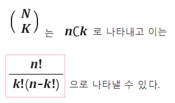

    
### [문제링크](https://www.acmicpc.net/problem/11050)

###  문제 해석 
이항계수( binomial coefficient ) 는 경우의 수를 계산할때 사용하는 것
 n개의 서로다른 것 들 중에서 k 개를 선택하는 것의 조합(combination)의 경우의 수를
 구하는 것이다.
 

### 

###  [풀이 과정] 
1. (n)
2. (k) 는 nCk 조합으로 나타낼 수 있다.
nCk-> factorial(n)//(factorial(k)*factorial(n-k))